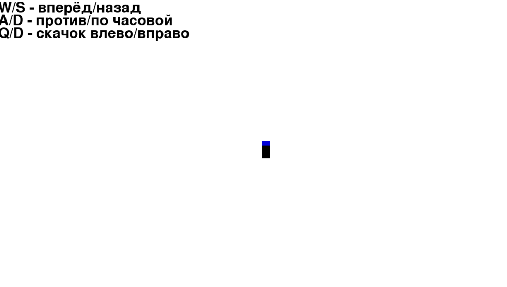
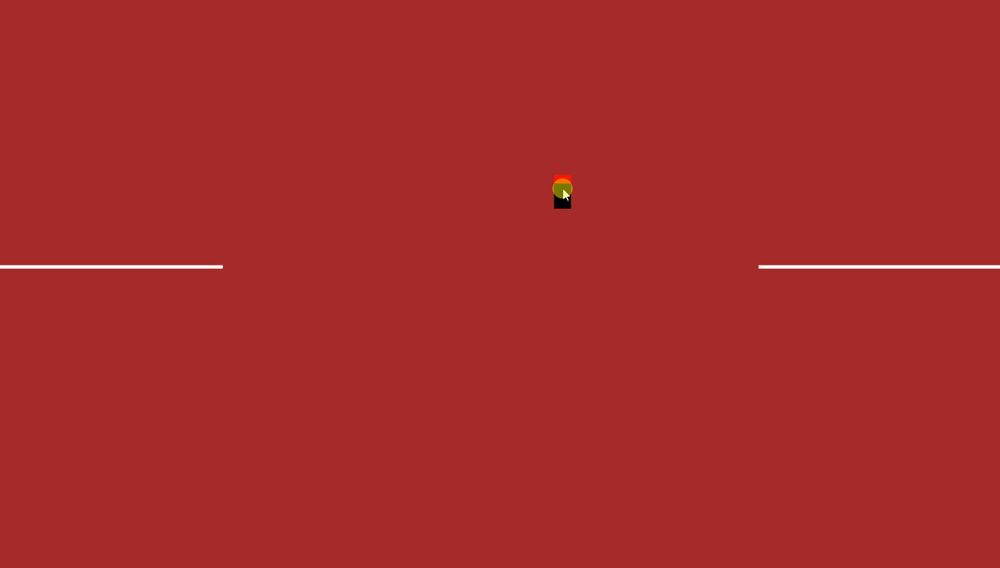

# 🕹️ Pygame Experiments Lab (pg_lab)

Коллекция интерактивных экспериментов, механик и мини-игр, созданных на движке **Pygame** и объединенных в удобный лаунчер. Проект демонстрирует базовые принципы объектно-ориентированного программирования (ООП), работу с двумерной графикой, векторами и обработку пользовательского ввода.

---

## 🚀 Основные возможности и эксперименты
Внутри лаунчера собрано несколько независимых модулей:
*   **Car Mechanics:** Симуляция движения автомобиля с физикой поворотов, стрейфом и правильной трансформацией спрайтов без потери качества.
*   **Panic Rect & Timelapse:** Эксперименты с таймингами, анимациями и поведением объектов на экране.
*   **Glass & Tunnel:** Работа с эффектами, прозрачностью (Alpha-канал) и геометрическими масками.
*   **Удобное меню:** Лаунчер построен на базе библиотеки `pygame-menu`, что позволяет легко переключаться между сценами без перезапуска программы.

---

## 🛠️ Стек технологий
*   **Язык:** Python 3.x
*   **Библиотеки:** `pygame`, `pygame-menu`
*   **Архитектурный подход:** ООП, модульная структура (разделение на настройки `settings.py`, вспомогательные инструменты `tools.py` и шаблоны сцен `model_template.py`).

---

## 💻 Инструкция по установке и запуску

### 1. Клонирование репозитория
Склонируйте проект на свой компьютер:
```bash
git clone https://github.com
cd pg_lab
```

### 2. Установка зависимостей
Установите необходимые библиотеки (рекомендуется использовать виртуальное окружение `venv`):
```bash
pip install -r requirements.txt
```

### 3. Запуск программы
Точкой входа в приложение является файл `menu.py`:
```bash
python menu.py
```


---
###  Демо
<p align="center">
  
  
  
</p>
<p align="center">
  
  
  
</p>

## 📁 Структура проекта
*   `menu.py` — главный файл лаунчера и инициализация графического интерфейса.
*   `settings.py` — глобальные константы проекта (разрешение экрана, FPS, цвета).
*   `tools.py` — утилиты для работы с текстом и визуальными элементами.
*   `model_template.py` — базовый шаблон (интерфейс) для создания новых сцен.
*   `/car`, `/glass`, `/panic_rect`, `/tunnelle` — изолированные модули с логикой конкретных экспериментов.
